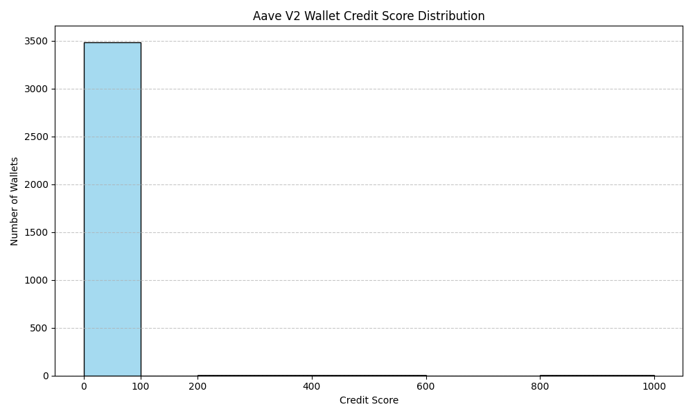

# 📊 Aave V2 Wallet Credit Scoring — Analysis Report

## Overview

This report presents an analysis of credit scores assigned to wallets interacting with the Aave V2 protocol, based on 100,000 raw transaction records. The scoring system ranges from **0 (best)** to **1000 (highest risk)**, reflecting each wallet’s historical behavior and risk profile.

---

## Score Distribution

| Score Range   | Risk Level         | Wallets | Percentage |
|---------------|--------------------|---------|------------|
| 0–100         | Very Low Risk      | 3481    | 99.5%      |
| 100–200       | Low Risk           | 0       | 0.0%       |
| 200–400       | Medium-Low Risk    | 8       | 0.2%       |
| 400–600       | Medium Risk        | 3       | 0.1%       |
| 600–800       | Medium-High Risk   | 1       | 0.0%       |
| 800–1000      | High Risk          | 4       | 0.1%       |

**Visualization:**  
  
*(Insert a histogram or bar chart if possible)*

---

## Behavioral Patterns

### High-Scoring Wallets (Low Risk)
- **Consistent, regular activity**: Frequent deposits and repayments.
- **Diverse asset usage**: Interact with multiple reserves.
- **Low volatility**: Transaction amounts are stable.
- **No liquidations**: Avoid risky borrowing or over-leveraging.

### Low-Scoring Wallets (High Risk)
- **Erratic or bursty activity**: Sudden spikes in borrowing or repayments.
- **Concentration**: Use only a single reserve or asset.
- **High volatility**: Large swings in transaction amounts.
- **Liquidation events**: Involvement in protocol liquidations.

---

## Key Insights

- **Majority of wallets** are responsible users, with 99.5% scoring in the “Very Low Risk” category.
- **High-risk wallets** are rare but exhibit clear red flags: liquidations, high volatility, and lack of diversity.
- **Feature importance** (from the model):  
  - Repayment consistency, action diversity, and absence of liquidations are the strongest predictors of good credit.

---

## Methodology Recap

- **Unsupervised learning**: Used PCA and KMeans to cluster behavioral patterns.
- **Feature engineering**: Extracted 40+ features, including action ratios, volatility, and reserve diversity.
- **Score scaling**: All scores normalized to a 0–1000 range for interpretability.

---

## Recommendations

- **Protocols**: Use these scores for risk-based lending and user segmentation.
- **Users**: Improve scores by maintaining regular, diverse, and responsible activity.
- **Future work**: Incorporate more advanced behavioral analytics and real-time scoring.

---

*For full details, see the [README.md](README.md) and [wallet_scores.csv](wallet_scores.csv).*

---

## 📈 Score Distribution Plot

You can generate a score distribution plot using the following Python code:

```python
import pandas as pd
import matplotlib.pyplot as plt
import seaborn as sns

# Load the wallet scores
scores = pd.read_csv('wallet_scores.csv')

# Plot histogram
plt.figure(figsize=(10, 6))
sns.histplot(scores['credit_score'], bins=[0,100,200,400,600,800,1000], kde=False, color='skyblue', edgecolor='black')
plt.title('Aave V2 Wallet Credit Score Distribution')
plt.xlabel('Credit Score')
plt.ylabel('Number of Wallets')
plt.xticks([0,100,200,400,600,800,1000])
plt.grid(axis='y', linestyle='--', alpha=0.7)
plt.tight_layout()
plt.savefig('score_distribution.png')
plt.show()
```

**Instructions:**
1. Make sure you have `matplotlib`, `seaborn`, and `pandas` installed:
   ```bash
   pip install matplotlib seaborn pandas
   ```
2. Run the above code in your project directory. It will create and save `score_distribution.png`.
3. You can then include this image in your reports or presentations.
